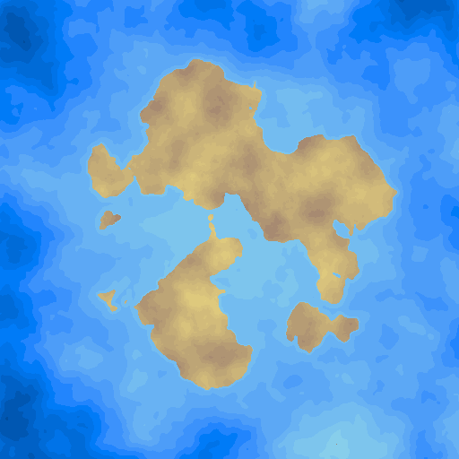

MapGen
======

Basic map generation done using noise, and simulations

### Currently working to
* Fix ocean simulation
* Remove lakes from ocean simulation
* Make ocean simulation more efficient
* Add coastal erosion to ocean simulation
* Add weather simulation
* Add river formation
* Up-scale simulation results to proper map size

## Requirements
#### Generation land formations
* The coastline should be sufficiently complicated.
* The number and size of continents/islands generated should be sufficiently varied.

#### Elevation mapping
* On average the highest points should be near the centre of landmasses, and should decline towards the coast.
* Elevation should consist of both smooth hills as well as mountains.

#### Temperature mapping
* The algorithm should simulate the sun on different areas of the map.
  * Areas near poles should receive less sunlight, and therefore be colder.
* Air pressure affects temperature, and should be simulated.
  * Ideally air pressure should be simulated as well as temperature, and be used in the temperature algorithm. However air pressure is also dependent on temperature which makes it more difficult to accurately simulate.
  * Places with high elevation have decreased air pressure, and therefore are colder.
* Water affects temperature, and should be simulated.
* Water should freeze in low temperatures.

#### Rainfall
* Rainfall affects the generation of rivers and lakes, and vegetation.
* Rainfall is dependent on humidity, temperature, and elevation.

#### Water flow
* Water flow deals with the formation of lakes and rivers.
* Rivers:
  * Should flow from high elevations down to coasts.
  * Should build up over time by eroding the terrain.
  * River flow should be affected by vegetation.
  * Should contain deltas.
  * Should cause floodplains.
  * Should affect humidity, and salinity.
  * Large rivers should affect the formation of lakes.
  * Towns should consider settling near rivers favourable. 
* Lakes:
  * Should form as a result of large rivers, mountainous areas, rift zones, and areas with ongoing glaciations.
  * Should affect humidity, and salinity.
  * Towns should consider settling near lakes favourable.
* Due to the reliance on rainfall simulations, water flow maybe implemented with rainfall.
* Temperature should affect water flow.